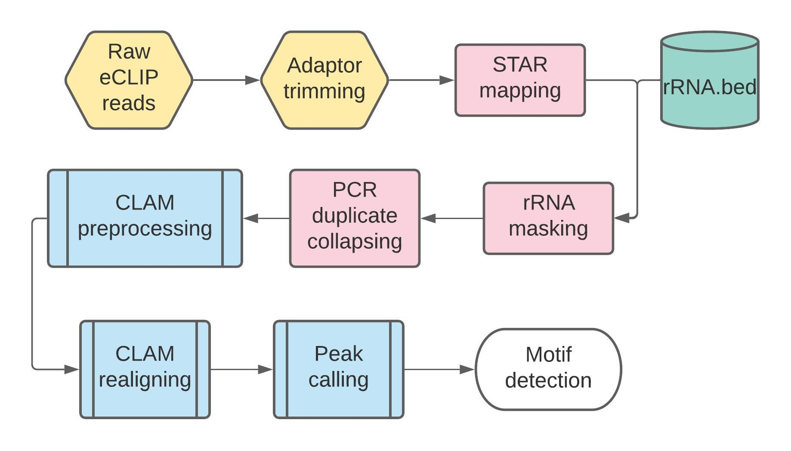
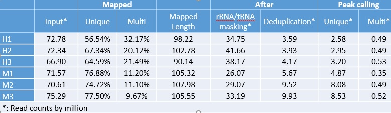
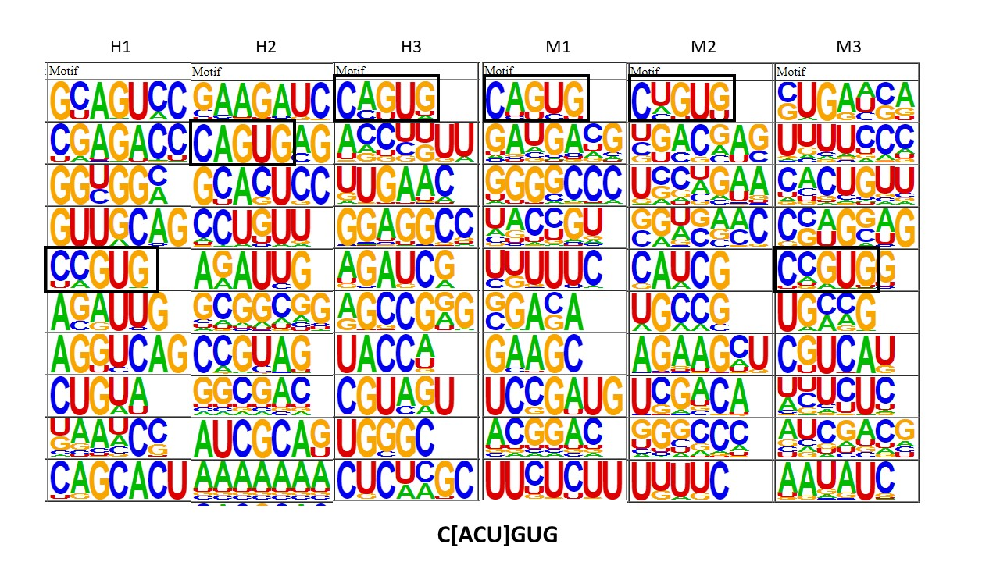

# RUN pipeline
I prepared 2 pipelines: bash command and Jupyter notebook.
The bash command can run directly on a linux workstation with over 80GB of free memory. The Jupyter notebook pipeline is for clusters using PBS to submit jobs(qsub). See the details below. 
## Run bash pipeline for MeCP2 iCLIP data
### Prerequisites
#### Enviroments
1. Python3 (Including package Numpy, Pandas, Scipy, pysam, pyBigWig)
2. cutadapt
3. fastqc
4. STAR
5. bedtools
6. CLAM (MUST >=v1.2.1)
7. wigToBigWig
8. Perl
9. Homer (including genome files for mm10 and hg19)
10. samtools 
#### Hardware 
1. Free RAM > 80GB (required)
2. CPU with more than 20 threads (recommanded) 
#### Files 
1. Human/mouse genome annotation (hg19.gtf/mm10.gtf) 
2. Human/mouse genome sequence (hg19.fasta/mm10.gtf) 
3. Human/mouse genome size (chr_size.txt) 
4. Human/mouse genome index for STAR (generated by STAR using genome sequences & annotations) 
5. rRNA/tRNA annotations for hg19 and mm10 
#### File organization 
Three directories should be provide:  
1. script_folder: the full path of subdirectory 'scripts' in this project (i.e.: ~/workspace/MeCP2_iCLIP/scripts) 
2. data_folder: the full path you wish to store all generated data files. This folder should contains 1 subfolder named raw_fq and put unzipped fq files in it (Undetermined_S0_L003_R1_001.fastq) 
3. genome_folder: the full path of your genome files, this folder should organized like (i.e.: ~/workspace/genome): 
genome/ 
├── raw 
│   ├── hg19 
│   │   ├── chr_size.txt 
│   │   ├── hg19.fasta 
│   │   ├── hg19.gtf 
│   │   └── rRNA_tRNA.bed 
│   └── mm10 
│       ├── chr_size.txt 
│       ├── mm10.fasta 
│       ├── mm10.gtf 
│       ├── mm10.trim.fasta 
│       └── rRNA_tRNA.bed 
└── star 
    ├── hg19 
    │   └── ... files of STAR index for hg19 
    └── mm10 
        └── ... files of STAR index for mm10 
## Run Jupyter notebook pipeline for MeCP2 iCLIP data
Prepare everything as bash pipeline, remember to run next cell only after all jobs submitted by the previous cell completed, this simple script DOES NOT check job status.

# Pipeline description
## Overview
  
## Step by Step
1. Demultiplex. NO mismatch allowed in barcode sequence.
2. Adapter triming.
3. STAR mapping.
4. rRNA/tRNA masking. Avoid contamination from rRNAs and tRNAs, generally, this step filtered out ~50% of mapped reads.
5. PCR duplication removal. Reads mapped to the same locations and carries same UMI were regard as PCR duplication. ~80% mapped reads removed.
6. CLAM preprocess. This step separates multi-mapped reads and uniquely mapped reads.
7. CLAM realign. This step realigned multi-mapped reads.
8. Peakcalling. As no control group available, use permutation peakcalling instead of negative biomial based peak calling for a better results. Tested peakcalling with bin-width of 100, 150 and 200. Bin-width=200 gave us better results (more consistent between different groups).
9. Motif detection.

# Results
## Mapping statistic
 
## Motif detection
For all 6 groups, we can see motifs similar to C[ACU]GUG. I'll suggest this motif as MeCP2 binding motif.
 
